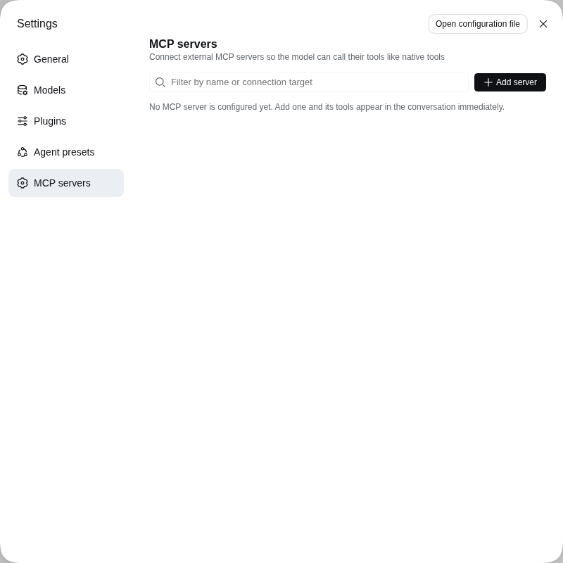
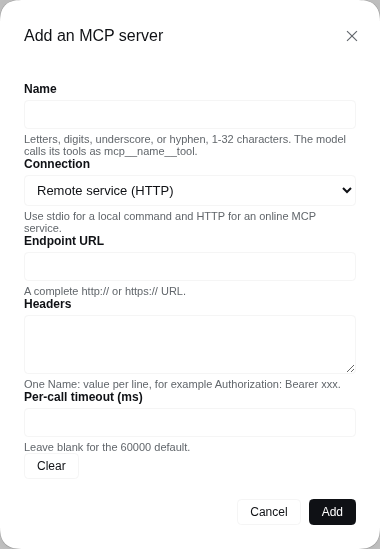
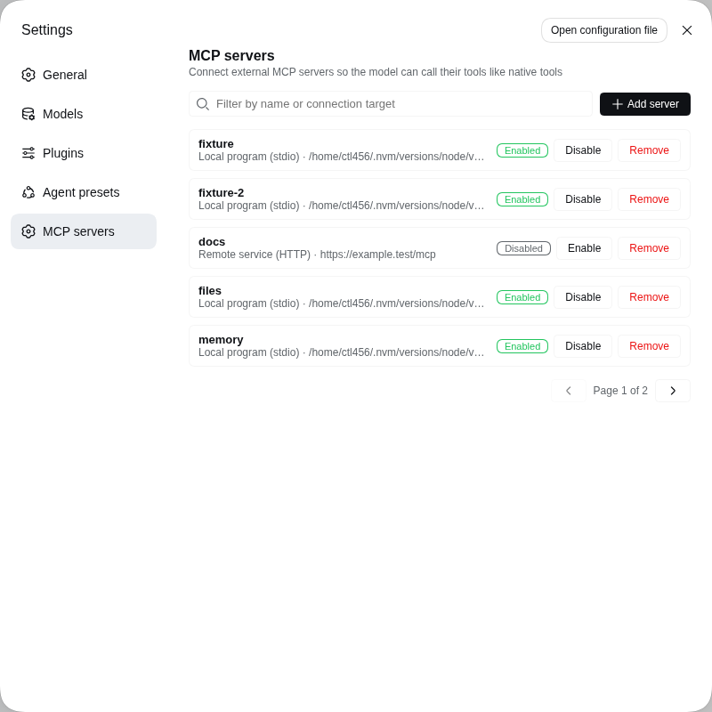

# dsh-mcp-manager

English | [中文](README.zh.md)

An **unofficial** plugin for DeepSeek Harness that manages external
[MCP](https://modelcontextprotocol.io) servers: add, remove, enable and disable
them from a Web settings card or from chat, and the harness calls their tools
like built-in tools.

> This project is not affiliated with, endorsed by, or supported by DeepSeek.
> See [NOTICE.md](NOTICE.md) for attribution and [LICENSE](LICENSE) for terms.

## What it does

- Keeps one list of external MCP servers and mounts one `dsh-mcp-client`
  connection per enabled entry.
- Publishes each enabled server's tools as native tools named
  `mcp__<server>__<tool>`, so the model calls them without any extra wiring.
- Adds, removes, enables and disables servers without editing YAML and without
  restarting the host.
- Gives beginners a form in the Web UI instead of a configuration file.

## Requirements

- A DeepSeek Harness install with the `dsh` CLI, version `0.1.5-rc.2` or
  compatible. The plugin declares the harness packages it plugs into as peer
  dependencies (`@deepseek-ai/dsh-mcp-client`, `dsh-settings`, `dsh-tools`,
  `dsh-util-values`, `@deepseek-ai/cordis`); the profile you install into must
  already provide them, which the shipped `web` profile does.
- Network access while installing, so npm can resolve those peers.

## Install

```sh
dsh plugin --profile web add @ctl456/dsh-mcp-manager
dsh --profile web
```

Any profile works; `web` is the one with the Web UI. Remove it with:

```sh
dsh plugin --profile web remove @ctl456/dsh-mcp-manager
```

To install a packed tarball or a checkout instead of the registry:

```sh
npm pack                                   # produces dsh-mcp-manager-<version>.tgz
dsh plugin --profile web add file:/abs/path/to/dsh-mcp-manager-0.1.0.tgz
```

## Use it in the Web UI

Open **Settings → MCP servers** — its own page in the settings nav, below
**Agent presets**.



| Field | Meaning |
|---|---|
| Name | The tool namespace: the model calls the server's tools as `mcp__<name>__<tool>`. Letters, digits, underscores, or hyphens, 1-32 characters. |
| Connection | **Local program (stdio)** launches a command; **Remote service (HTTP)** connects to a Streamable HTTP endpoint. |
| Command / Arguments / Environment / Working directory | stdio only. One argument per line and one `NAME=value` per line; an empty working directory inherits the host's. |
| Endpoint URL / Headers | HTTP only. One `Name: value` per line. |
| Per-call timeout (ms) | Optional; blank uses 60000. |

**Add server** opens a dialog; choosing **Remote service (HTTP)** swaps the stdio
fields for **Endpoint URL** and **Headers**.



Fill the fields and press **Add**. The page lists every configured server with its
target, an **Enable** or **Disable** switch, and **Remove**; a name that already
exists replaces that entry. The list pages five at a time, and the filter box
matches on both the name and the connection target.



## Manage servers from chat

`mcp_manager_list` reads the current list; `mcp_manager_add`,
`mcp_manager_remove` and `mcp_manager_set_enabled` change it. Every call returns
the fresh list with each server's transport, target, enabled state, connection
status, tools and configuration problems, so you can ask the model to add a
server instead of filling the form.

## Where the configuration lives

The card and the tools edit the same `mcp-manager` section of
`$DSH_HOME/settings.yaml`. The `servers` array in `cordis.patch.yml` seeds the
composition base layer, so a profile or `--patch` overlay can preconfigure
servers, while the settings document stays the value that wins.

## Limitations

- The manager bridges tools only; MCP resources and prompts are not supported.
- Credentials in Environment and Headers are stored as plain settings values, so
  prefer variables your shell already exports and reference them by name.
- The card shows configuration, not live connection health; use
  `mcp_manager_list` for connection status.

## Rebuilding the bundled artifacts

`lib/` and `src/` are built inside a DeepSeek Harness checkout, because the
upstream build chain is workspace-coupled: the host bundle comes from the
repository-root `tsdown` config plus the Typert codegen plugin, and the browser
bundle from `packages/client/tsdown.client.ts` and its helpers. Building this
package standalone is therefore not supported.

```sh
git clone https://github.com/deepseek-ai/deepseek-harness
cd deepseek-harness && pnpm install && pnpm run build
cd /path/to/dsh-mcp-manager
scripts/sync-from-harness.sh /path/to/deepseek-harness
```

The script refreshes `lib/`, `src/` and `cordis.patch.yml`, re-applies this
repository's package name, and rewrites `PROVENANCE.md` with the harness version
and commit.

## Verify before publishing

```sh
npm run verify:install
```

It packs the tarball, checks the payload, installs it into a throwaway profile
with `dsh plugin add file:<tarball>`, and asserts that the composed profile tree
contains the `mcp-manager` row. That is the gate that separates "works from a
checkout with `link:`" from "works the way a user installs it".

## Licence

MIT, with the upstream copyright notice retained — see [LICENSE](LICENSE) and
[NOTICE.md](NOTICE.md).
