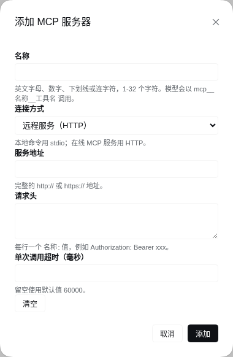
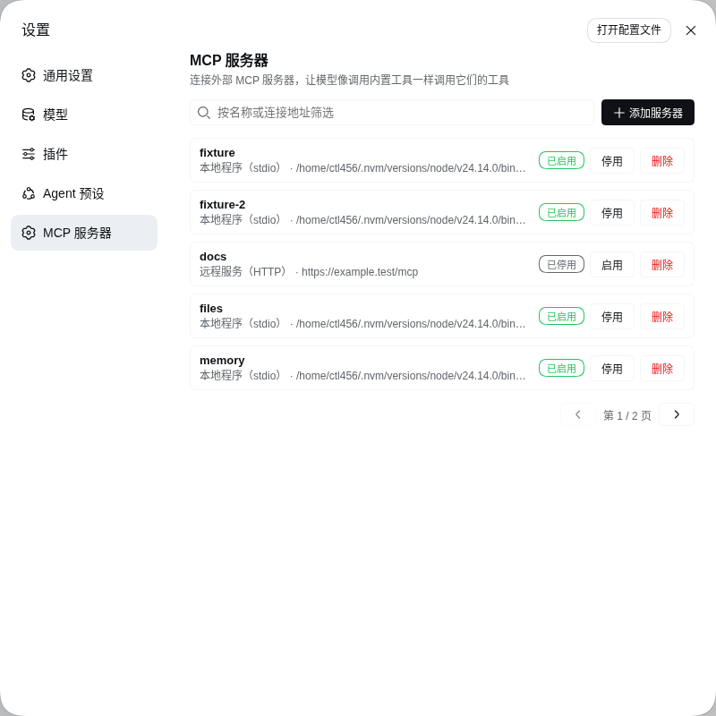

# dsh-mcp-manager

[English](README.md) | 中文

一个**非官方**的 DeepSeek Harness 插件，用来管理外部
[MCP](https://modelcontextprotocol.io) 服务器：在 Web 设置卡片或对话里新增、删除、
启用和停用，之后 harness 就能像调用内置工具一样调用它们的工具。

> 本项目与 DeepSeek 无隶属关系，也未获得其认可或支持。归属说明见
> [NOTICE.md](NOTICE.md)，许可条款见 [LICENSE](LICENSE)。

## 它做什么

- 维护一份外部 MCP 服务器清单，为每个启用条目挂载一个 `dsh-mcp-client` 连接。
- 把每个启用服务器的工具注册为原生工具 `mcp__<服务器>__<工具>`，模型可直接调用。
- 新增、删除、启用、停用都无需编辑 YAML，也无需重启 Host。
- 给小白一个 Web 表单，而不是一个配置文件。

## 环境要求

- 已安装 DeepSeek Harness 与 `dsh` CLI，版本 `0.1.5-rc.2` 或兼容版本。插件把所接入
  的 harness 包声明为 peer 依赖（`@deepseek-ai/dsh-mcp-client`、`dsh-settings`、
  `dsh-tools`、`dsh-util-values`、`@deepseek-ai/cordis`），安装目标 profile 必须已
  经提供它们，随附的 `web` profile 即是如此。
- 安装过程需要网络，以便 npm 解析这些 peer 依赖。

## 安装

```sh
dsh plugin --profile web add @ctl456/dsh-mcp-manager
dsh --profile web
```

任意 profile 都可以，`web` 是带 Web UI 的那个。卸载：

```sh
dsh plugin --profile web remove @ctl456/dsh-mcp-manager
```

也可以安装打包好的 tarball 或本地 checkout，而不走 registry：

```sh
npm pack                                   # 生成 dsh-mcp-manager-<版本>.tgz
dsh plugin --profile web add file:/绝对路径/dsh-mcp-manager-0.1.0.tgz
```

## 在 Web UI 中使用

打开 **设置 → MCP 服务器** —— 设置导航里的独立页面，位于 **Agent 预设** 下方。


| 字段 | 含义 |
|---|---|
| 名称 | 工具命名空间：模型以 `mcp__<名称>__<工具名>` 调用该服务器的工具。只能使用英文字母、数字、下划线或连字符，1-32 个字符。 |
| 连接方式 | **本地程序（stdio）** 会启动一个命令；**远程服务（HTTP）** 会连接 Streamable HTTP 端点。 |
| 命令 / 参数 / 环境变量 / 工作目录 | 仅 stdio。参数每行一个，环境变量每行一个 `名称=值`；工作目录留空则继承 Host 的当前目录。 |
| 服务地址 / 请求头 | 仅 HTTP。请求头每行一个 `名称: 值`。 |
| 单次调用超时（毫秒） | 可选；留空使用 60000。 |

点击 **添加服务器** 会弹出对话框；选择 **远程服务（HTTP）** 后，stdio 字段会
换成 **服务地址** 和 **请求头**。



填好字段后按 **添加**。页面列出每个已配置服务器的连接目标、**启用** 或 **停用**
开关，以及 **删除**；添加已存在的名称会覆盖该条目。列表每页显示五条，筛选框
同时匹配名称和连接目标。



## 在对话中管理服务器

`mcp_manager_list` 读取当前清单；`mcp_manager_add`、`mcp_manager_remove` 和
`mcp_manager_set_enabled` 修改它。每次调用都返回最新清单，包含每个服务器的传输
方式、连接目标、启用状态、连接状态、工具和配置问题，因此你可以直接让模型新增
服务器，而不必填写表单。

## 配置存放位置

卡片和工具编辑的是同一份 `$DSH_HOME/settings.yaml` 中的 `mcp-manager` 节。
`cordis.patch.yml` 里的 `servers` 数组是组合配置的基础种子层，因此 profile 或
`--patch` overlay 可以预配置服务器，而设置文档始终是最终生效的值。

## 限制

- 管理器只桥接工具；不支持 MCP resources 和 prompts。
- 环境变量和请求头中的凭据以明文设置值保存，因此请优先使用 shell 已导出的变量，
  并在服务器支持时按名称引用它们。
- 卡片展示的是配置，不是实时连接健康状态；连接状态请通过 `mcp_manager_list` 获取。

## 重新构建随包产物

`lib/` 与 `src/` 是在 DeepSeek Harness 仓库内构建的，因为上游构建链与工作区耦合：
宿主 bundle 来自仓库根 `tsdown` 配置加 Typert 代码生成插件，浏览器 bundle 来自
`packages/client/tsdown.client.ts` 及其辅助模块。因此不支持脱离 harness 独立构建。

```sh
git clone https://github.com/deepseek-ai/deepseek-harness
cd deepseek-harness && pnpm install && pnpm run build
cd /path/to/dsh-mcp-manager
scripts/sync-from-harness.sh /path/to/deepseek-harness
```

该脚本会刷新 `lib/`、`src/` 和 `cordis.patch.yml`，重新应用本仓库的包名，并把
harness 版本与 commit 写入 `PROVENANCE.md`。

## 发布前自检

```sh
npm run verify:install
```

它会打包 tarball、检查包内文件、用 `dsh plugin add file:<tarball>` 装进一个临时
profile，并断言组合出的 profile 树里出现 `mcp-manager` 行。这道关卡区分了
“用 `link:` 从 checkout 能跑”和“用户按正常方式安装能跑”。

## 许可

MIT，保留上游版权声明 —— 见 [LICENSE](LICENSE) 与 [NOTICE.md](NOTICE.md)。
